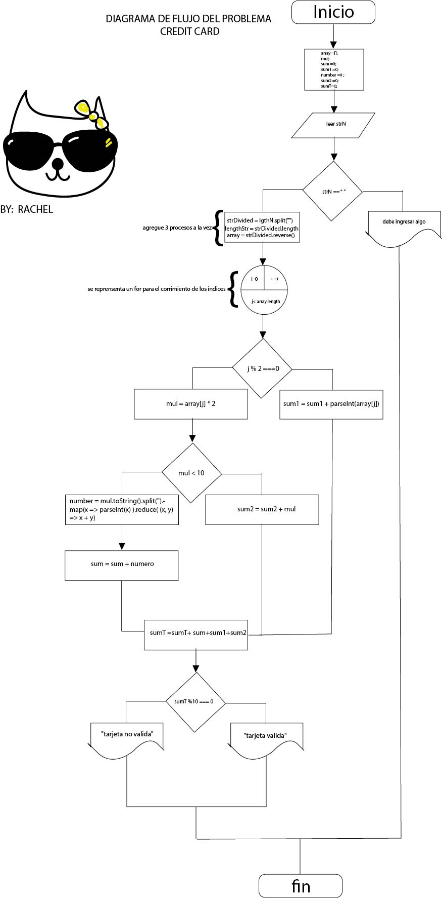

# PSEUDOCODIGO DEL PROBLEMA *CREDIT CARD* :credit_card:
## BY Rachel :bowtie: :cat:
### Con diagrama de flujo en github :octocat:

1. Preguntar por el numero de la tarjeta
    * Esto se hara mediante un promt y se guarda en una variable ```var strN = prompt ("introduce tu cadena de numeros)```
2. Pasar los números de un array en orden inverso
    * Para hacer esto primero dividir nuestra cadena de numerosintroducidos ```var strDivided = lgthN.split("");```
    * Despues vamos a contar cuantos caracteres se introdujeron despues de cortarlos ```var lengthStr = strDivided.length```
    * Y por ultimo vamos a almacenar en nuestro array vacio nuestros caracteres y con la funcion reverse vamos a invertirlos ```array = strDivided.reverse()```
3. Aplicar la operación a los numeros de las posiciones pares para Esto
    * Si estan en posiciones pares multiplicalos por dos y si tienen dos digitos, corta la cadena y somalos ```number = mul.toString().split('').map(x => parseInt(x) ).reduce( (x, y) => x + y);```
    * Sespues has la suma de ellos ```sum = sum + numero```
4. Si la suma de todos los anteriores modulo de 10 da 0 es valida si no de lo contrario no es valida ```if(sumT %10 === 0)```

*flowchart*


_Espero y se entienda_ :stuck_out_tongue_winking_eye:
